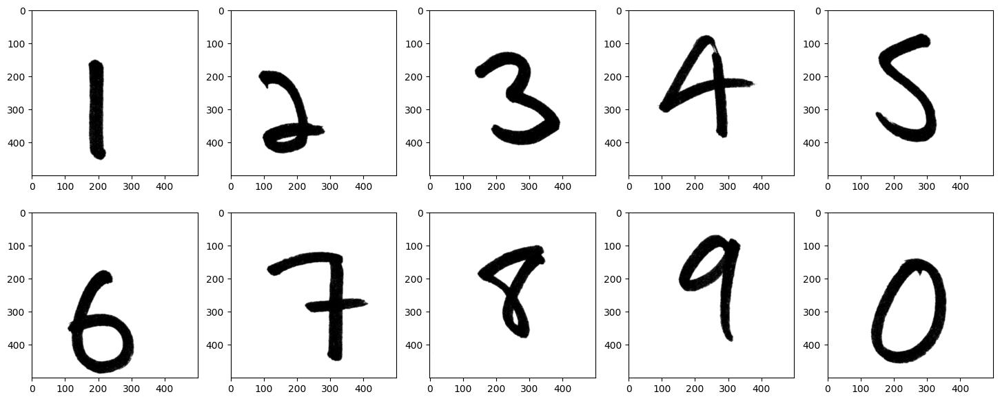
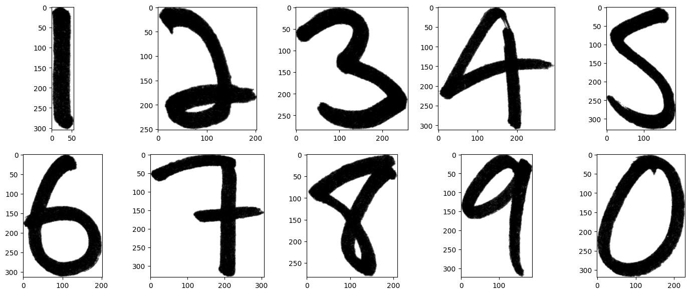

# **About**
Handwritten digits detection using a [YOLOv8](https://docs.ultralytics.com/modes/) detection model and ONNX pre/post processing 

# **Data**
The dataset consists of images created with the use of a [HWD+](https://www.ncbi.nlm.nih.gov/pmc/articles/PMC9702948/) dataset.

## HWD+
The [HWD+](https://www.ncbi.nlm.nih.gov/pmc/articles/PMC9702948/) dataset consists of gray images of single handwritten digits in high resolution (500x500 pixels).

## yolo_HWD+
The `yolo_HWD+` dataset is composed of images which are produced with the use of `HWD+` dataset. Each `yolo_HWD+` image has many single digits on one image and each digit is properly annotated (*class x_center y_center width height*). The processing of `HWD+` to obtain `yolo_HWD+`:
1. Cut the digit from each image (`HWD+` images have a lot of white background around)
2. Take `n` digit images and form a **nrows x ncols** grid.
3. Randomly place each digit in *ij* cell and save its label and location as annotation. 

Example below:

#### Raw digits (before any processing)

#### Cut digits (after step 1)

#### Formed grid (left) and with annotations (right)

# **Model results**